<div align="center">
  <h1>⏰ AlarmPro SaaS Platform</h1>
  <p><strong>A Premium, Multi-Genre Alarm & Task Scheduler Ready for Monetization</strong></p>
  
  [](https://alarmpro-demo.onrender.com)
</div>

---

## 🚀 Overview

**AlarmPro** is a highly polished, **Progressive Web Application (PWA)** built to solve a critical problem: generic web alarms fail when the browser tab goes to sleep. AlarmPro fixes this natively, providing a true iOS/Android caliber alarm experience inside a web browser.

It is lightweight, ultra-fast, and built specifically to be monetized as a niche productivity SaaS (Student Study, Gym Workout, Exam Planner).

### 🎯 Key Commercial Features:
- **Instant alarm stop via push notification sync**: Click a desktop notification, and it immediately stops the ringing sound without searching for the app tab.
- **Dynamic Multi-Tenant UI Themes**: Instantly adapts its user interface based on 3 core "Genres" (📚 Student, 💪 Gym Workout, 📝 Exam Planner) using purely CSS. 
- **True PWA Installability**: Installs seamlessly as a native desktop/mobile app on Windows, macOS, iOS, and Android.
- **Secure Persistence via Node/SQLite**: User authentication ensures data is secured and isolated per user.

---

## 💰 Monetization Ideas

This platform is primed for revenue generation on day one. Here are proven ways to monetize this codebase:
- **SaaS Subscription for Students**: Charge $2.99/mo for advanced exam schedules.
- **Gym Timer Premium Plans**: Partner with fitness influencers to white-label the "Gym Workout" theme.
- **White-label Licensing**: Sell the unbranded engine to coaching institutes or corporate wellness programs.

---

## 💎 Feature Pricing Hooks (Upsell Strategy)

You can easily split the current features into Free / Premium tiers:
- **Unlimited Alarms** ➔ Premium users only (Free limited to 3 active alarms)
- **Smart Scheduling & Tracking** ➔ Premium
- **Push Notifications Integration** ➔ Premium
- **Custom Theme Colors** ➔ Premium

---

## 📸 Real UI Screenshots

*Clean, minimalist UI built with strict dark-mode principles and vibrant neon accents. Judged perfect for mobile and desktop.*

<p align="center">
  
  
</p>

---

## 🛠 Tech Stack & Architecture

```mermaid
flowchart LR
    subgraph Client ["CLIENT (BROWSER)"]
        direction TB
        subgraph MainThread ["Main UI Thread (Vanilla JS)"]
            direction TB
            UIR["UI Rendering (Native DOM)"]
            TM["Theme Manager (CSS Variables)"]
            AM["Alarm Manager"]
            Audio["Audio Stream (Web Audio API)"]
        end
    end
    
    subgraph PWA ["PWA SERVICES"]
        direction TB
        subgraph SW ["SERVICE WORKER (sw.js)"]
            CS["Caching Strategy (Network-First)"]
            PN["Push Notification Handler"]
            OS["Offline Sync Queue"]
        end
        
        subgraph WW ["WEB WORKER (worker.js)"]
            HP["High-Precision Heartbeat (0.001s Accuracy)"]
        end
    end

    subgraph Backend ["BACKEND & PERSISTENCE"]
        direction TB
        subgraph Node ["Node.js REST API (Express)"]
            JWT["JWT Auth Middleware"]
            VAL["Validation Logic"]
            CRUD["CRUD Controllers"]
        end
        DB[("SQLite3 DATABASE\n(Users, Alarms, Sync Log)")]
    end
    
    %% Relationships
    MainThread <-->|"Push Notification Event"| SW
    SW <-->|"Secured HTTPS Requests"| Node
    Node <--> DB
    MainThread <-->|"PostMessage API"| WW
```



| Layer | Technology |
|---|---|
| **Frontend UI** | HTML5 / CSS3 / Vanilla JS (No heavy frameworks) |
| **PWA Core** | Service Workers + Web Manifest |
| **Web Workers** | Native `Worker` API |
| **Backend API** | Node.js + Express.js |
| **Database** | SQLite3 (Extremely portable) |

---

## ⚙️ Quick Start Installation & Deployment

### Step 1: Deploy Demo
The backend runs cleanly on **Render.com** or **Railway.app** for free. Simply connect this GitHub repository and deploy `server.js` as a Web Service to automatically get your Live Demo URL.

### Step 2: Local Installation (For Customization)
```bash
git clone https://github.com/pavankumar9d-rgb/task.git
cd task2-website
npm install
npm run dev
```

Navigate to `http://localhost:3000` to preview your changes!
