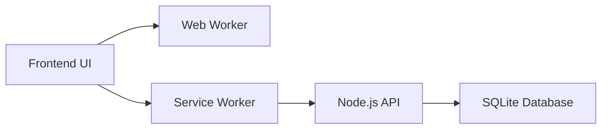

# ⏰ AlarmPro SaaS Platform

<div align="center">

### 🚀 A Premium, Multi-Genre Alarm & Task Scheduler Built for Monetization

[](https://alarmpro-demo.onrender.com)

</div>

---

## 🧠 Overview

**AlarmPro** is a high-performance **Progressive Web Application (PWA)** engineered to solve a critical limitation in modern browsers:

> ❌ Standard web alarms fail or delay when browser tabs become inactive.

AlarmPro overcomes this using **Web Workers and Service Workers**, delivering a **native mobile-like alarm experience** directly in the browser.

Designed for scalability and monetization, AlarmPro is ideal for launching a **productivity SaaS**, targeting students, fitness users, and professionals.

---

## 💎 Core Features

* ⚡ **Reliable Alarm Execution**
  Maintains precise timing even when browser tabs are inactive.

* 🔔 **Instant Alarm Stop via Notification Sync**
  Stop alarms directly from push notifications without opening the app.

* 🎨 **Dynamic Multi-Genre UI Themes**
  Built-in themes for:

  * 📚 Students
  * 💪 Gym Workouts
  * 📝 Exam Planning

* 📲 **PWA Installability**
  Install as a native app on:

  * Android
  * iOS
  * Windows
  * macOS

* 🔐 **Secure User Authentication**
  Data is fully isolated per user with backend validation.

---

## 🧠 Why AlarmPro Wins

* ✅ Works even when browser tabs are inactive
* ✅ Installable as a native app (no App Store required)
* ✅ Lightweight frontend (<100KB)
* ✅ Zero heavy frameworks (pure Vanilla JS)
* ✅ Fast load times and high performance

---

## 💰 Monetization Opportunities

AlarmPro is structured for immediate revenue generation:

* 💳 **SaaS Subscription Model**

  * Charge monthly for premium features (₹99–₹299 / $2–$5)

* 🏋️ **Fitness Market Licensing**

  * Sell branded versions to gym trainers & influencers

* 🎓 **Student Productivity Platform**

  * Offer advanced exam planners and reminders

* 🏢 **White-Label Licensing**

  * Sell to coaching institutes and corporate wellness programs

---

## 💎 Premium Feature Strategy

Easily implement a **Free vs Premium model**:

| Feature            | Free        | Premium   |
| ------------------ | ----------- | --------- |
| Active Alarms      | Limited (3) | Unlimited |
| Smart Scheduling   | ❌           | ✅         |
| Push Notifications | ❌           | ✅         |
| Custom Themes      | ❌           | ✅         |

---

## 🎯 Target Buyers

* Indie hackers building SaaS products
* EdTech startups and coaching institutes
* Fitness trainers launching digital apps
* Developers seeking ready-made PWA solutions

---

## 📸 Screenshots

> Add real UI screenshots inside `/assets` folder

<p align="center">
  
  
</p>

---

## 🛠 Tech Stack

| Layer                 | Technology                      |
| --------------------- | ------------------------------- |
| Frontend              | HTML5, CSS3, Vanilla JavaScript |
| Backend               | Node.js + Express.js            |
| Database              | SQLite3                         |
| PWA                   | Service Workers + Web Manifest  |
| Background Processing | Web Workers                     |

---

## 🏗 Architecture Overview



---

- **Email:** `demo@alarmpro.com`
- **Password:** `123456`

> **Note:** Demo Mode now supports **Real Persistence**. Tasks you add or delete are saved to the local SQLite database so you can experience the full functional workflow.

---

## ⚙️ Quick Start

### 🔧 Prerequisites

* Node.js (v18+)

---

### 📦 Installation

```bash
git clone https://github.com/pavankumar9d-rgb/task.git
cd task2-website
npm install
npm run dev
```

---

### 🌐 Run Application

```id="nx8d7o"
http://localhost:3000
```

> **Direct Access**:
> - **Landing Page**: http://localhost:3000/
> - **App Dashboard**: http://localhost:3000/app

---

## 🌍 Live Demo

👉 [https://alarmpro-demo.onrender.com](https://alarmpro-demo.onrender.com)


```

---

## 💳 Payment Integration (Optional Upgrade)

To enable real monetization, integrate:

* Stripe
* Razorpay

---

## 📈 Deployment

Easily deploy backend using:

* Render
* Railway

Frontend can be hosted on:

* Vercel

---

## 📦 What You Get

* ✔ Full Source Code (Frontend + Backend)
* ✔ PWA-Ready Application
* ✔ Authentication System
* ✔ Alarm Engine with Worker Threads
* ✔ Monetization-Ready Structure

---

## 📄 License

This project is provided for commercial use, modification, and resale depending on your licensing model.

---

## 🤝 Support

For setup help or customization, you can extend this project easily due to its clean and modular architecture.

---

## 🚀 Final Note

AlarmPro is not just a project—it is a **ready-to-launch SaaS foundation** designed for speed, scalability, and monetization.

> Build fast. Launch faster. Scale smarter.

---


