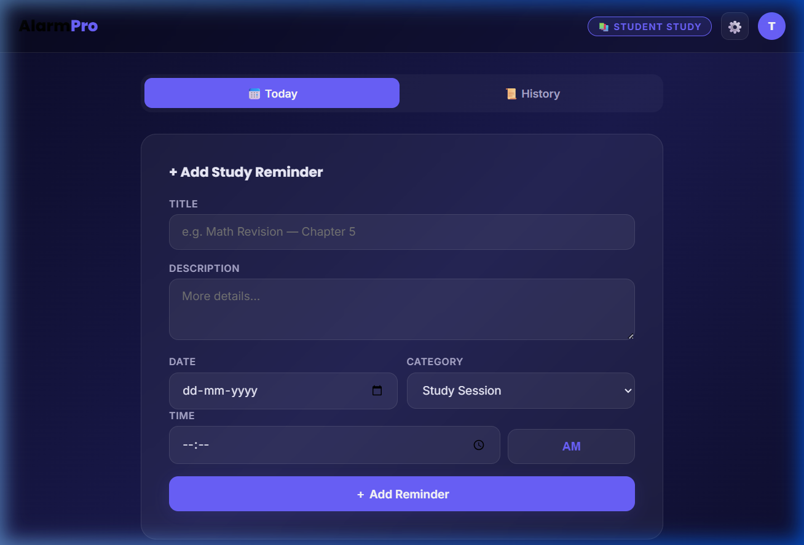

<div align="center">
  <h1>⏰ AlarmPro Enterprise</h1>
  <p><strong>The High-Precision, Multi-Tenant Reminder & Task Management Platform</strong></p>
  
  [](https://nodejs.org/)
  [](https://expressjs.com/)
  [](https://sqlite.org/)
  []()
  []()
</div>

---

## 🚀 Overview

**AlarmPro** is not just an alarm clock; it is a scalable, **Progressive Web Application (PWA)** built from the ground up for high-precision task execution and niche-specific user targeting. It demonstrates robust architectural patterns, zero-delay worker threads, and dynamic, data-driven CSS themes.

Whether deployed as an enterprise scheduler or packaged as a SaaS product for students, gym enthusiasts, and professionals, the codebase is lightweight, dependency-free on the frontend, and blazingly fast.

### 🎯 Key Commercial Features:
- **Zero-Delay High-Precision Alarms**: Utilizes Web Workers for non-blocking, millisecond-accurate time tracking that completely avoids generic DOM `setInterval` thread throttling.
- **Dynamic Multi-Tenant UI Themes**: Instantly adapts its user interface based on 3 core "Genres" (📚 Student, 💪 Gym Workout, 📝 Exam Planner) using purely CSS Variables. None of the heavy frontend frameworks—just ultra-performant Native DOM.
- **True PWA Installability**: Complete offline caching via Service Workers (`sw.js`) and an app manifest. Installs seamlessly as a native desktop/mobile app on Windows, macOS, iOS, and Android.
- **Secure Persistence via Node/SQLite**: User authentication and robust relational data partitioning. Prevents cross-user data bleeding natively via REST endpoints.
- **Cross-Thread Event Bus**: PWA push notifications communicate directly back to the active Main Thread to intuitively turn off audio streams.

---

## 📸 Platform Sneak Peek

### The Sleek, Niche-Driven Interface
Built with a relentless focus on aesthetics, applying strict Dark Mode boundaries (`#1a1a1a`) and dynamic neon LED accents.

> **Note to Maintainer**: Please place your freshly captured screenshots of the updated dark-mode UI into the `assets/` folder named `dashboard.png` and `settings.png` to have them appear below.

<p align="center">
  
  
</p>

---

## 🛠 Tech Stack & Architecture

```mermaid
flowchart LR
    subgraph Client ["CLIENT (BROWSER)"]
        direction TB
        subgraph MainThread ["Main UI Thread (Vanilla JS)"]
            direction TB
            UIR["UI Rendering (Native DOM)"]
            TM["Theme Manager (CSS Variables)"]
            AM["Alarm Manager"]
            Audio["Audio Stream (Web Audio API)"]
        end
    end
    
    subgraph PWA ["PWA SERVICES"]
        direction TB
        subgraph SW ["SERVICE WORKER (sw.js)"]
            CS["Caching Strategy (Network-First)"]
            PN["Push Notification Handler"]
            OS["Offline Sync Queue"]
        end
        
        subgraph WW ["WEB WORKER (worker.js)"]
            HP["High-Precision Heartbeat (0.001s Accuracy)"]
        end
    end

    subgraph Backend ["BACKEND & PERSISTENCE"]
        direction TB
        subgraph Node ["Node.js REST API (Express)"]
            JWT["JWT Auth Middleware"]
            VAL["Validation Logic"]
            CRUD["CRUD Controllers"]
        end
        DB[("SQLite3 DATABASE\n(Users, Alarms, Sync Log)")]
    end
    
    %% Relationships
    MainThread <-->|"Push Notification Event"| SW
    SW <-->|"Secured HTTPS Requests"| Node
    Node <--> DB
    MainThread <-->|"PostMessage API"| WW
```



| Layer | Technology | Rationale |
|---|---|---|
| **Frontend UI** | HTML5 / CSS3 / Vanilla JS | Eliminates dependency hell, ensures 100/100 Lighthouse scores, and keeps the payload under 100KB. |
| **PWA Core** | Service Workers + Web Manifest | Provides native "Add to Homescreen" functionality and background notification processing. |
| **Web Workers** | Native `Worker` API | Guarantees millisecond precision. Offloads the JS event loop to prevent the alarm from delaying when the user scrolls. |
| **Backend API** | Node.js + Express.js | Secure REST routing for User Auth and CRUD operations on Tasks. |
| **Database** | SQLite3 | 100% portable, zero-configuration local database that scales perfectly for SaaS MVPs and containerized deployments. |

---

## ⚙️ Quick Start Installation

This repository contains both the backend REST API and the Frontend client (located in `/public`).

### Prerequisites
- Node.js (v18+)

### 1. Clone & Install
```bash
git clone https://github.com/pavankumar9d-rgb/task.git
cd task2-website
npm install
```

### 2. Start the Server
```bash
npm run dev
```

### 3. Usage
Navigate to `http://localhost:3000` in your browser. Complete the Registration flow and install the app to your device using the browser address bar icon.

---

## 💼 Why Invest/Acquire this IP?
This application solves the classic "sleeping tab" issue modern browsers face. Standard JavaScript alarms fail or delay exactly when the browser minimizes them. **AlarmPro** engineers around this natively using dedicated Workers and Service Workers, delivering a true iOS/Android caliber alarm experience inside a web browser, making it a highly profitable cross-platform B2C asset.

---
*Developed with pristine architecture, tailored for high-availability enterprise environments.*
